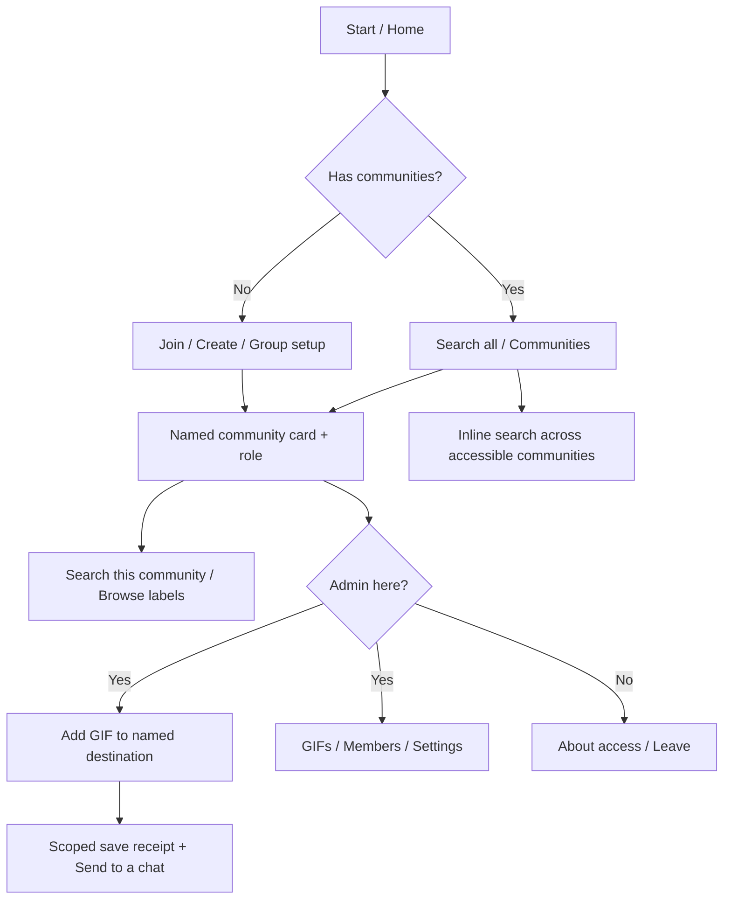

# Gifory UX review

Date: 2026-10-03. Reviewed the current working tree, including the earlier uncommitted reliability changes.

## Verdict

Gifory asks users to understand its storage and permission model before they can experience its value. The most serious problem is the meaning of **active community**: it selects the archive for tags and management, while inline search still searches every accessible community. Selecting a community immediately offers a search button, reinforcing the wrong expectation.

The recommended product model is: **search all your GIFs by default; open a named community to browse or manage its archive; explicitly offer search within that community.** Show the community name, the user's role, and the available actions together. Make the first successful search or save happen through buttons and short prompts, rather than a command reference.

This requires navigation and interaction changes as well as better copy. Rewriting `/help` alone will leave the central confusion in place.

## Evidence and limits

This is a code-based walkthrough and public-documentation comparison, not a participant usability study or a live Telegram client test. Findings about current behavior are traced to handlers, middleware, strings, and data operations. Predicted user confusion is expert judgment; no conversion rates or user quotes are claimed.

Reviewed: entry and middleware registration, both locales, keyboard and command publication, onboarding, creation/joining/invites, community selection, group lifecycle/access, inline search, tags, GIF upload/edit/delete/replacement, pending operations, members and roles, leave, language, notifications, statistics, and backup delivery. Existing regression tests were inspected for coverage, not rerun as proof of UX quality.

The tag parser was also exercised locally without service connections: plain `happy excited` produced no labels; English and Ukrainian hashtag/emoji examples parsed; `#добрий-день` became `#добрий`; `🏷 #happy` parsed as valid labels, confirming that the earlier keyboard-prefix interceptor can divert otherwise usable input. All local report links were checked for existence.

No VPS access, production writes, Telegram account interaction, bot changes, or deployment was performed. BotFather profile/inline placeholder/privacy settings and deployed-version parity remain unverified. The public `t.me/giforybot` page could not be retrieved during this review; the username appears in repository copy. Proposed copy should use the runtime bot username.

## Current mental model, reconstructed

| Context | What selects the archive? | What the user sees |
|---|---|---|
| Private chat: save/edit/delete/invite/members/stats/backup | Persistent active community | Usually no community name in GIF prompts or confirmations |
| Private chat: tags | Active community | Catalog and counts, without community name |
| Group: archive operations and tags | The current Telegram group's archive | Same generic prompts; personal active community is irrelevant |
| Inline search in any chat | All accessible communities | GIFs without source names; a “Use these GIFs” link on sent results |
| Pending GIF tagging | Community captured when the flow started | Destination is invisible, even after changing active community |
| `/scopes` callback, including in groups | Changes the clicking user's private active preference | Shared message says “Active community,” followed by global search |

Sources: [scope resolution and registration](src/bot.ts), [picker](src/handlers/onScopes.ts), [inline handler](src/handlers/onInline.ts), [tags](src/handlers/onTags.ts), [pending text](src/handlers/onText.ts).

## User journeys

| Journey | Current path and friction | Target outcome |
|---|---|---|
| New user with no communities | `/start` explains the concept and commands; Search leads to an empty inline result and a join button | Offer joining, creating, or group setup before empty search; explain that this searches saved community GIFs |
| Invited member | Link immediately joins, selects the community, sends two messages and a search button | Named member welcome, one search action, “admins add GIFs,” and access explanation |
| Returning member | `/start` repeats newcomer instructions | Home recognizes existing communities and offers search immediately |
| First-time creator | `/create` from menu sends no name and returns syntax; after creation primary button searches an empty archive | Ask for a name, then guide saving the first GIF; invite after the first save |
| Group admin installing bot | Scope/admin data is created silently | Group setup acknowledgment, readiness status, explicit saving instructions, private management link |
| Existing group member starting privately | Group may not be tracked for that member until an interaction or membership update reaches the bot | A group-specific opening link verifies membership and opens the archive |
| Member of multiple communities | Names and a checkmark are the only picker information | Show name, type, role and selected destination; distinguish global and local search |
| Admin uploading with no selection | Picker appears; incoming GIF is not retained or resumed | Retain the upload while choosing an eligible destination, then resume |
| Admin switching during tagging | Pending input still updates the original archive | Explicit destination in prompt and save receipt; safe resume/cancel |
| Admin editing/deleting | Find a GIF elsewhere, send/reply to it, remember commands; deletion is immediate | Scoped archive browser or named GIF actions with a preview and removal confirmation |
| Admin managing members | Read paginated list, then type username/ID or reply elsewhere | Select a member from the list, inspect role, then confirm scoped actions |
| Leaving, lost access, or outage | Leave has confirmation; lost access and failed Telegram verification can both look like missing communities | Distinguish leaving an archive, leaving a group, and temporary verification failure |

## Prioritized findings

Priorities: **P0** = fix before promoting the bot more widely; **P1** = next coherent UX release; **P2** = follow-up improvement. These are UX priorities, not security incident classifications.

### P0: meaning, first success, and destinations

**F01 — The picker implies a search filter it does not apply.** Select A, press its Search button, and B's GIFs remain eligible. `/scopes` says “activate,” but never explains which actions change. Evidence: [onScopes.ts](src/handlers/onScopes.ts), [onInline.ts](src/handlers/onInline.ts), [English copy](src/i18n/en.ts). Replace activation-only confirmation with a community card. Label global search “Search all my communities” and add an explicit community-only search action. Preserve global search as the default.

**F02 — No visible destination for GIF changes.** Save, duplicate, tag replacement, and file replacement messages omit the community. A safe captured-scope implementation can still surprise a user after switching communities. Evidence: [onAnimation.ts](src/handlers/onAnimation.ts), [onCallback.ts](src/handlers/onCallback.ts), [onText.ts](src/handlers/onText.ts), [onEdit.ts](src/handlers/onEdit.ts), [onDelete.ts](src/handlers/onDelete.ts). Name the archive before input and in every receipt. Show existing tags before replacement. For a GIF shared by multiple archives, target the selected archive explicitly.

**F03 — First-run and returning `/start` are identical.** Existing members are told to ask for an invite or create a community again. A creator is offered search before adding anything. Evidence: [bot.ts](src/bot.ts), [onCreateScope.ts](src/handlers/onCreateScope.ts), both locale `start_welcome` strings. Use no-membership, member, and admin/empty-archive states. One main action should lead to a first search or first save.

**F04 — Selecting a community loses the user's attempted action.** `/tags` with no selection opens a picker; selecting ends at global Search rather than the catalog. An upload without selection is not queued, so it must be resent. Evidence: [promptScopeSelect](src/handlers/onScopes.ts), [isAdmin.ts](src/middleware/isAdmin.ts), [onTags.ts](src/handlers/onTags.ts). Capture the intended action and incoming GIF when appropriate; resume after selection, rechecking permissions. For write operations list communities the user can administer. Do not replay a destructive command without a fresh named confirmation.

**F05 — Management is difficult to discover in private chat.** The persistent keyboard contains Search, Tags, Communities, Help, Language. The admin command menu is published only for `all_chat_administrators`, which does not identify admins of manual communities in private chats. Help is the main discovery route. Evidence: [keyboard.ts](src/keyboard.ts), [commands.ts](src/commands.ts), [onHelp.ts](src/handlers/onHelp.ts). Give admins a Manage action on each authorized community card and a direct Add GIF action. Telegram menus are an aid; server-side scope checks remain mandatory.

### P1: broken expectations and incomplete flows

**F06 — Community picker supplies too little context.** No type, role, count, stable ordering, disambiguation, pagination, create/join action, or explanation of selection. Same-name communities look identical; Redis set order is not a navigation order. Evidence: [onScopes.ts](src/handlers/onScopes.ts), [getUserScopes](src/scopes.ts). Use a sorted paginated list, type/role labels, details, and create/join entry points. Provide a short identifier in details only when needed to distinguish duplicates. Counts must reflect accessible searchable GIFs and should not delay the picker unnecessarily.

**F07 — Tag browsing and searching have different boundaries.** Catalog counts come from A, but tapping a tag searches all communities. Old pagination buttons encode only page number; after changing to B, paging the old A message fetches B's tags. Evidence: [onTags.ts](src/handlers/onTags.ts), [getTagFacets](src/meili.ts). Bind every catalog page to its original scope and reauthorize it; name that scope in the header. A tag button should search that catalog's archive. Offer a separate all-community search.

**F08 — Emoji-only collections appear to have an empty catalog.** Upload permits an emoji with no hashtag, but facets include only `tags`. Evidence: [onAnimation.ts](src/handlers/onAnimation.ts), [getTagFacets](src/meili.ts). Include emojis in browse, or separate Tags and Emojis. Distinguish “no hashtags” from “no saved GIFs.”

**F09 — Inline mode lacks useful recovery when there are no results.** No-community search has a join button, but a member's empty archive or no-match query gets an empty response without a bot recovery button. There is no source labeling or explicit collection filter. The same GIF can legitimately appear once per community. Evidence: [onInline.ts](src/handlers/onInline.ts), [searchGifs](src/meili.ts). Add a bot button for search help/community choice in no-result states, with examples and an admin-specific save route in the bot. Keep diagnostic messages out of sendable GIF results. Consider deduplicating global presentation while retaining separate scoped records and correct usage attribution.

**F10 — Search tutorials happen in the bot chat, not the intended destination.** All current search buttons use `switchInlineCurrent`; selecting a result there sends it to the bot. For an admin, that animation can trigger another upload/duplicate flow. Evidence: [onKeyboardButton.ts](src/handlers/onKeyboardButton.ts), [onAnimation.ts](src/handlers/onAnimation.ts), [bot.ts](src/bot.ts). In private onboarding offer “Send a GIF to a chat” using Telegram's destination chooser and “Try here” as secondary. Ignore archival side effects for the bot's own inline results unless saving is explicitly requested. Keep current-chat inline search in group contexts. The button behavior is documented in the [Bot API](https://core.telegram.org/bots/api#inlinekeyboardbutton).

**F11 — The public GIF button promises access it cannot grant.** “Use these GIFs” opens `scope_<id>`; strangers are rejected and asked for an invite. Existing members receive “You joined” even though they just reopened an archive, and their active destination changes. Evidence: [onInline.ts](src/handlers/onInline.ts), [onDirectJoinScope](src/handlers/onJoinScope.ts). Use “About this community,” explain access boundaries, and distinguish opening from joining. Opening a shared GIF's information should not silently change the private upload destination. This access restriction must remain intact.

**F12 — Invite use limit is hidden.** Tokens expire after 24 hours **and are consumed by the first successful join**. A creator can share one link with friends and only the first succeeds. Evidence: [consumeInviteToken](src/scopes.ts), locale `invite_link` and `join_invalid`. Say “One person can use this link. Expires in 24 hours,” provide Generate another, and say a failed link may be expired or already used. Reusable invitations would be a separate product/access decision, not a copy fix. Reopening a consumed link also deserves an existing-member recovery path when the community can be identified safely.

**F13 — Group setup is silent and the invite explanation points at the wrong action.** `onMyChatMember` logs scope creation but sends no onboarding. `/invite` in an existing group says to add the bot, which has already happened. Ordinary existing members are not necessarily known from installation alone. Evidence: [onMyChatMember.ts](src/handlers/onMyChatMember.ts), [onInvite.ts](src/handlers/onInvite.ts), [onChatMember.ts](src/handlers/onChatMember.ts), [resolveScope](src/bot.ts). Acknowledge readiness, explain bot-admin requirements, supply a membership-checked private opening link, and describe group membership as access. Telegram privacy mode and bot-admin message delivery affect which GIFs and replies arrive; test those settings rather than assuming plain group messages are received. See [Telegram privacy mode](https://core.telegram.org/bots/features#privacy-mode).

**F14 — Group conversations are treated as archive input.** Every animation from an authorized admin can become an archive upload; a GIF replying to a GIF is automatically file replacement. Members posting GIFs can receive permission rejection. Evidence: [bot.ts](src/bot.ts), [onAnimation.ts](src/handlers/onAnimation.ts), [isAdmin.ts](src/middleware/isAdmin.ts). Prefer deliberate Add/save interactions in groups, a reply-to-bot upload flow, or an explicitly explained opt-in auto-save mode. File replacement should be an explicit action. Ordinary group conversation should stay quiet. This is a product behavior change and needs a rollout note to existing admins.

**F15 — Group picker claims activation that group commands ignore.** Running `/scopes` inside Group A and selecting B changes the private preference, but `/tags` or an upload in Group A still uses A. It also edits a shared picker message with one person's preference. Evidence: [bot.ts](src/bot.ts), [onScopes.ts](src/handlers/onScopes.ts). Keep group actions tied to that group; open the personal community picker privately. Group replies should say “This group's archive: A.”

**F16 — Pending flows lack consistent escape and association.** Search silently clears a pending upload; Help, Tags, Communities and Language do not. Plain non-command text can still complete the old flow after navigation. There is no `/cancel`; a new animation silently replaces the previous pending operation. Prompts are not sent as ForceReply or linked to the uploaded message. Evidence: [onKeyboardButton.ts](src/handlers/onKeyboardButton.ts), [onText.ts](src/handlers/onText.ts), [onAnimation.ts](src/handlers/onAnimation.ts), [session.ts](src/session.ts). Add `/cancel`, visible named pending status, consistent resume/cancel rules, and reply association in groups. On expiry explain that nothing was saved and give a resend action. Retain existing operation-token/user/message and captured-scope authorization protections.

**F17 — Duplicate buttons name neither the object nor the consequence.** “Replace all,” “Add new,” and “No” could mean files, tags, or archive records. Evidence: locale `gif_btn_*`, [onAnimation.ts](src/handlers/onAnimation.ts). Use “Replace tags,” “Add tags,” and “Keep current tags”; show the community and current labels. Keep file replacement separate.

**F18 — Text and unsupported input produce inconsistent feedback.** An idle admin's text reaches `onText` and returns silently; an idle member gets unknown-input help. A member's unknown slash command is called a permission problem. Stickers/documents/videos have no useful specific response. Emoji-prefix routing intercepts arbitrary text such as `🏷 #happy`, taking it to the catalog instead of a pending tagging flow. Evidence: [bot.ts](src/bot.ts), [isAdmin.ts](src/middleware/isAdmin.ts), [onText.ts](src/handlers/onText.ts), [onKeyboardButton.ts](src/handlers/onKeyboardButton.ts). Match actual localized keyboard labels, separate unknown commands from authorization, and provide contextual private-chat recovery. Recognize unsupported media without noisy group replies. Decide explicitly whether plain private text should search; initially show a search button rather than making ambiguous text mutate data.

**F19 — Tag format needs examples and parsing feedback.** A user typing `happy excited` supplies no accepted labels. Hashtags are lowercased; punctuation can truncate a tag (`#добрий-день` becomes `#добрий`), and the regex does not accept every Unicode writing system. Evidence: [utils/tags.ts](src/utils/tags.ts), locale prompts. Show `#happy #reaction 😂` / `#радість #реакція 😂`, explain the syntax, and echo parsed labels. Validate or warn about truncation. Offer suggestions from the current archive. Preserve Ukrainian support; define whether plain words and broader Unicode tags will be supported before changing the parser.

**F20 — Destructive management lacks a review step and a complete role lifecycle.** `/del` deletes immediately and confirms only by reaction; `/kick` removes a user and revokes every outstanding invite without advance explanation; `/promote` is immediate. No demote, ownership transfer, or community deletion UI exists. Evidence: [onDelete.ts](src/handlers/onDelete.ts), [onKick.ts](src/handlers/onKick.ts), [onPromote.ts](src/handlers/onPromote.ts), [onLeave.ts](src/handlers/onLeave.ts), [scopes.ts](src/scopes.ts). Confirm named scope/GIF/member and consequences before delete, kick, or promotion. Start with member action buttons and clear permissions. Specify demotion/transfer/closure policies before exposing new destructive capabilities; preserve the last-admin guard. Group roles must remain managed through Telegram.

### P2: supporting experience

**F21 — Help overload and language navigation.** `/help` shows every admin command to members; `/lang` resets the message to newcomer welcome. User-selected language changes reply text, but published menus use Telegram language scope and are not updated per user. Evidence: [onHelp.ts](src/handlers/onHelp.ts), [onLang.ts](src/handlers/onLang.ts), [commands.ts](src/commands.ts). Short role-aware task help, then expandable Search/Add/Manage topics. Return language changes to Home and synchronize per-user command presentation where practical. Use text labels with icons; never rely on emoji or color alone.

**F22 — Notifications omit their origin.** A multi-community admin receives “New GIF added” and tags without community or author, and replying to it with `/edit` targets their current community. No preference/digest exists. Evidence: [broadcast.ts](src/broadcast.ts), [onEdit.ts](src/handlers/onEdit.ts). Include community and actor, attach a scoped management entry point, and offer per-community notification settings. Check live authority before opening management.

**F23 — Statistics and backup are technical dead ends.** Stats show tag text rather than a way to inspect/use the GIF; empty stats gives no explanation. Help calls backup “full archive as JSON,” while manual delivery uses the current scope and backup transport can compress/split files. A group admin who has never started the bot privately can encounter a generic DM delivery failure. Evidence: [onStats.ts](src/handlers/onStats.ts), [onBackup.ts](src/handlers/onBackup.ts), [backup.ts](src/backup.ts), [BACKUP.md](BACKUP.md). Add scoped GIF links/previews to stats, explain that inline usage is measured, name the archive in export, and provide a private-chat opening/retry path. Describe backups as recovery metadata, not downloaded GIF binaries or a user-facing import feature.

**F24 — Temporary verification failure looks like permanent absence.** Access functions intentionally fail closed on Telegram errors, but callers can show “no communities” or “no longer available” rather than temporary verification failure. Evidence: [access.ts](src/access.ts), [onScopes.ts](src/handlers/onScopes.ts), [bot.ts](src/bot.ts). Preserve fail-closed access while surfacing an unavailable/retry state distinct from removed membership. Do not invite users to recreate an existing archive because Telegram is rate-limited.

**F25 — Parameters and names need client-oriented polish.** `/create@giforybot Name` and `/rename@giforybot Name` are matched by grammY, but the handlers strip only `/create` or `/rename`, leaving the bot mention in the stored name. Names can be duplicated and long buttons need mobile checks. Evidence: [onCreateScope.ts](src/handlers/onCreateScope.ts), [onRename.ts](src/handlers/onRename.ts). Parse framework command arguments, offer prompted naming, disambiguate same names, and test long English/Ukrainian labels and Cyrillic names on narrow screens. Verify localized profile descriptions and inline placeholder in BotFather separately.

## Comparison with other Telegram experiences

Public documentation was checked on the review date. These are capability/pattern comparisons, not claims that a competitor's complete current conversation was exercised or that its usability is proven.

| Reference | Documented behavior | Lesson for Gifory | Important difference |
|---|---|---|---|
| `@gif` | Enter username and keywords in any chat; tap a result to send. [Telegram's inline introduction](https://telegram.org/blog/inline-bots) | Teach one concrete send action and get to results quickly | Gifory searches membership-controlled saved content; it must explain access and empty archives |
| `@TagdBot` / TaggedBot | Its public profile describes tagging stickers, GIFs and videos and retrieving them through inline queries. [Bot profile](https://t.me/TagdBot) | Closest functional comparator: describe Gifory as saving/tagging now and finding later | Profile does not establish community support, current tag syntax, or the current step-by-step flow; do not assume those features |
| `@Stickers` | Telegram documents a Mini App for managing sticker/emoji packs and statistics, with text commands also available. [Official sticker documentation](https://core.telegram.org/stickers) | Collections should be visible objects with actions; commands can remain shortcuts | Sticker packs are a different format and sharing/access model; this does not justify making Gifory archives public |
| Manybot | Its site documents custom commands and multilevel menus for interaction without typing commands. [Manybot](https://manybot.io/) | Put management behind task menus rather than expecting command memorization | A bot-creation platform, not a GIF collection service; its admin model should not replace Gifory's per-community permissions |
| Telegram's native sticker editor | Documented creation, choosing emojis, adding to sets, and sharing sets. [Sticker editor](https://telegram.org/blog/sticker-maker) | Show collection context, give a short guided create/add/share progression, and offer emoji suggestions | Native editor features and public sticker-set links are not directly available for private GIF archives |

Telegram also documents keyboards, command scopes, contextual inline buttons, and editing navigation messages in its [bot features guide](https://core.telegram.org/bots/features). The recommendation to use these for Gifory is design judgment. A Mini App could eventually improve bulk visual management, but is unnecessary for fixing onboarding, destination clarity, and community selection.

## Recommended navigation and behavior

### Home

Private keyboard: **Search GIFs · Communities · Help · Settings**. Language moves under Settings. On Home show global search coverage and, if applicable, the selected archive for private saves. Admin actions appear on community cards rather than permanently implying global admin rights.

New user: Join a community / Create a community / Set up for a Telegram group. Joining help explains “open the link an admin sent you”; entering a raw token is an advanced fallback. Group setup opens Telegram's add-to-group flow and then verifies readiness. Avoid suggesting a discoverable directory of private communities.

Returning member: Search all my communities is primary. One community can open directly; multiple communities have a picker. No need to choose a community just to run global search. If exactly one eligible upload destination exists, name it and proceed; if several exist, choose explicitly.

### Community card and picker

Example list: `✅ Friends · Member · Invite-only`, `Studio · Admin · Telegram group`, `My reactions · Admin · Invite-only`. Use “Invite-only community” instead of “manual scope” or “private community,” which can be confused with a private Telegram group.

Opening the card shows name, type, role, searchable GIF count, search/browse actions, and whether it is the private save destination. Member actions: Search this community, Browse tags and emojis, About/access, Leave. Admin actions additionally: Add GIF, Manage. Manage contains GIFs, Members, Invites for invite-only communities, Statistics, Rename, Backup; group role controls direct users to Telegram. Show unavailable options with a reason only where helpful; do not clutter a member's view with admin controls.

Selection in private chat sets the management destination explicitly. Group operations always stay within that group. A group opening link and a forwarded GIF's About link open information without silently changing destination. Every Back action returns to the previous named screen.

### Search semantics

Keep `@<bot> happy` searching all accessible communities. Introduce an explicit scope query emitted by community/tag buttons, for example `in:<opaque-id> happy`, parsed server-side. This is a proposed protocol, not current functionality. Authorize the requested scope live; treat malformed/unauthorized filters as recoverable empty states, never fall back to searching other communities. Do not depend on community names being unique.

Do not persist the last scoped search as a hidden global filter. When the user invokes the bot normally again, global search remains global. Scope query syntax is an implementation detail; buttons and friendly help should handle it. Show the source community where Telegram's GIF result presentation permits it, and on the sent GIF's About button; confirm exact rendering on clients.

### Add and manage

`Community → Add GIF → Send animation → Enter #tags / emoji → Saved to <name> → Send to a chat / Add another`. Caption tags remain a shortcut. Prompt with a reply to the incoming GIF, and use reply association for group text. Keep pending GIF identity, destination and authorization captured throughout. Navigation offers Resume or Cancel instead of silently discarding an upload.

For editing, let admins browse the community's GIFs, open a scoped preview, and choose Add tags / Replace tags / Replace file / Delete. Delete confirmation must name the archive and preview the exact GIF. Member management should start from the member list, not copying IDs. Permission checks run on every action and confirmation; role and type displayed in old messages are not authorization.

## Proposed screen copy

Copy below describes the proposed flows, not features already implemented. Counts/names are illustrative. All shipped strings must be keyed in both locale files; dynamic values must be escaped if HTML is used.

| Screen | English | Ukrainian |
|---|---|---|
| No communities | “Save your community's GIFs and find them in any Telegram chat. To start, open an invite link from an admin or create a community.” Buttons: “How to join” / “Create a community” / “Set up for a group” | “Зберігайте гіфки своєї спільноти та знаходьте їх у будь-якому чаті Telegram. Щоб почати, відкрийте запрошення від адміністратора або створіть спільноту.” Buttons: “Як приєднатися” / “Створити спільноту” / “Налаштувати для групи” |
| Returning home | “Search GIFs from your 3 communities. In this private chat, GIF changes apply to Friends.” Buttons: “Search all communities” / “Open Friends” / “Communities” | “Шукайте гіфки з ваших 3 спільнот. У цьому особистому чаті зміни гіфок стосуються спільноти «Друзі».” Buttons: “Шукати в усіх спільнотах” / “Відкрити «Друзі»” / “Спільноти” |
| Community picker | “Choose a community to browse or manage. Regular inline search still searches all your communities.” | “Оберіть спільноту для перегляду архіву або керування ним. Звичайний інлайн-пошук і далі шукає в усіх ваших спільнотах.” |
| Member card | “Friends · Invite-only community\nYour role: Member · 42 GIFs\nYou can search and send GIFs. Admins add and edit them.” | “Друзі · Спільнота за запрошенням\nВаша роль: учасник · Гіфок: 42\nВи можете шукати й надсилати гіфки. Додають і редагують їх адміністратори.” |
| New admin card | “My reactions is ready. You're an admin. Add your first GIF to make it searchable.” Buttons: “Add first GIF” / “Invite a member” | “Спільнота «Мої реакції» готова. Ви адміністратор. Додайте першу гіфку, щоб її можна було знайти.” Buttons: “Додати першу гіфку” / “Запросити учасника” |
| Joined | “You joined Friends as a member. Search and send its GIFs in any chat. Admins manage the archive.” | “Ви приєдналися до спільноти «Друзі» як учасник. Шукайте й надсилайте її гіфки в будь-якому чаті. Архівом керують адміністратори.” |
| Send tutorial | “Choose a chat, type a word or emoji after @<bot>, then tap a GIF to send it. Example: @<bot> happy. Only GIFs saved in your communities appear.” | “Оберіть чат, введіть слово або емоджі після @<bot>, а потім натисніть гіфку, щоб надіслати її. Приклад: @<bot> радість. У результатах будуть лише гіфки, збережені у ваших спільнотах.” |
| Tag prompt | “Adding this GIF to Friends. Send labels, for example: #happy #reaction 😂. The GIF will be saved after you send labels.” Button: “Cancel” | “Додаємо цю гіфку до спільноти «Друзі». Надішліть теги, наприклад: #радість #реакція 😂. Гіфку буде збережено після надсилання тегів.” Button: “Скасувати” |
| Save receipt | “Saved to Friends. Labels: #happy 😂.” Buttons: “Send to a chat” / “Add another” / “Open community” | “Збережено у спільноті «Друзі». Теги: #радість 😂.” Buttons: “Надіслати в чат” / “Додати ще” / “Відкрити спільноту” |
| Invite | “Invite one person to Friends. This link works once and expires in 24 hours. Generate another link for another person.” | “Запросіть одну людину до спільноти «Друзі». Посилання можна використати один раз протягом 24 годин. Для іншої людини створіть нове посилання.” |
| Permission recovery | “You're a member of Friends. Only its admins can add or change GIFs.” Buttons: “Search GIFs” / “Choose another community” | “Ви учасник спільноти «Друзі». Додавати або змінювати гіфки можуть лише її адміністратори.” Buttons: “Шукати гіфки” / “Обрати іншу спільноту” |
| Empty catalog | “Friends has no saved GIFs yet. An admin needs to add the first one.” Admin button: “Add first GIF”; member button: “Other communities” | “У спільноті «Друзі» ще немає збережених гіфок. Першу має додати адміністратор.” Admin button: “Додати першу гіфку”; member button: “Інші спільноти” |
| Used/expired invite | “This invite has expired or was already used. Ask a community admin for a new link. Already a member? Open Communities.” | “Термін дії запрошення минув або його вже використали. Попросіть адміністратора спільноти надати нове посилання. Ви вже учасник? Відкрийте «Спільноти».” |
| Delete confirmation | “Delete this GIF from Friends? It will disappear from this community's search. Copies in other communities remain.” Buttons: “Delete from Friends” / “Cancel” | “Видалити цю гіфку зі спільноти «Друзі»? Вона зникне з пошуку цієї спільноти. Копії в інших спільнотах залишаться.” Buttons: “Видалити зі спільноти” / “Скасувати” |
| Verification failure | “I couldn't check your group access right now. Try again shortly.” Button: “Try again” | “Зараз не вдалося перевірити ваш доступ до групи. Спробуйте ще раз трохи пізніше.” Button: “Спробувати ще раз” |

Group setup should additionally say who can save GIFs, whether saving is deliberate or automatic, that access follows current Telegram membership, and how to open the group archive privately. A sole admin's blocked leave screen should offer a member-management route instead of only saying to promote someone.

## Delivery sequence

| Stage | Deliverables | Acceptance evidence |
|---|---|---|
| 1 — Make the model visible | State-aware Home/help; community card/picker with role/type; named destinations; exact keyboard matching; accurate single-use invites; private admin entry points; recoverable unknown input | New/returning/member/admin scripted walkthroughs; EN/UK review; no ambiguous “active” or duplicate labels; preserved authorization tests |
| 2 — Complete the journeys | Resume interrupted upload/tags; explicit scoped inline query; scope-bound catalogs including emojis; destination chooser; contextual no-results; group setup/private opening; deliberate group save and explicit file replacement; pending cancel/resume | Two same-tag communities; switch during upload; old-page clicks; unauthorized filter; bot-inline GIF doesn't auto-upload; real Telegram group/client checks |
| 3 — Make management usable | Scoped GIF previews/actions; member action menus and confirmations; role lifecycle policy; notification preferences/source; export/private-delivery recovery; stable pagination and name parsing | Exact target and scope in confirmations; revoked rights reject old buttons; invite revocation shown before kick; last-admin protection; backup DM recovery |

Stage 1 is an improvement, not completion of the redesign. F01/F04/F07 and management require behavior changes in later stages. Avoid inventing global admin roles or relaxing membership checks to simplify UI.

## Validation plan

Use a separate test bot and disposable databases with synthetic GIFs; production credentials and existing archives are unnecessary. Telegram notes that file IDs belong to a bot identity, so test media should be uploaded to the test bot rather than copying production IDs. See [testing your bot](https://core.telegram.org/bots/features#testing-your-bot).

### Required scenario checks

1. New user with zero communities reaches join/create/group setup without an unexplained empty search.
2. Invite opens a named member welcome; second use explains the link limit and offers recovery. Joining does not imply admin rights.
3. Creator enters a name through prompts, saves the first GIF with caption labels or prompted labels, then sends it to another chat.
4. A returning member gets Home rather than newcomer setup; a returning admin sees management only for authorized communities.
5. A and B share a tag and a GIF. Global search includes authorized archives; A's search and tag counts remain scoped to A. Duplicate presentation retains correct provenance/usage attribution.
6. An upload with no selection resumes after choosing an administered community. Cancel or expiry saves nothing and explains recovery.
7. Start tags in A, open B, then finish or page the old A flow. Both retain visible A context and valid authorization.
8. Select a community while inside Group A. Group actions still visibly target A; private destination changes are made privately.
9. Group setup with bot as member/admin and privacy mode enabled: verify receipt of commands, animation uploads, and tag replies. Current members can open privately through the group link; departed users cannot.
10. Ordinary group GIF conversation and the bot's own inline results do not unexpectedly save/replace files or trigger repetitive permission messages.
11. Delete/kick/promote confirmation shows the exact scope and target; changes in permission or membership between prompt and click are rejected. Sole-admin leave remains blocked with a next action.
12. Plain text, unknown slash commands, `🏷 #happy`, stickers/video/documents, expired prompts and double clicks all have deliberate behavior in both roles.
13. Language override, Telegram language, old-language buttons, narrow-screen Ukrainian labels, same-name communities, long names, and large paginated lists are readable and consistent.
14. Temporary access-verification errors keep membership data intact and expose retry, not false removal or recreation guidance.
15. Notifications show origin and scoped management; backup from a group with no open private bot chat offers a DM setup/retry path; empty stats explains how usage is measured.

### Participant validation after implementation

Recruit 5–8 people covering newcomers, community members, creators, and multi-community admins, including Ukrainian speakers. Give tasks without mentioning commands: join a friend's archive; send a reaction GIF to another chat; create a collection and save a GIF; choose where a new GIF goes; find only one community's results; change labels; remove a member. Ask them to predict the destination/search coverage before acting.

Suggested release gates, to be measured rather than claimed now: at least 80% complete each core task without intervention; every tested participant correctly predicts the archive before a write; no wrong-community mutation in scripted scenarios. Record time to first successful send/save, wrong-path attempts, requests for help, and the points where users cannot explain their role. A small sample gives qualitative direction, not population-level conversion estimates.

Optional privacy-preserving events: onboarding state shown, picker opened/selected, resumed flow, save completed, inline result chosen, management action confirmed/cancelled, recovery state shown. Avoid logging raw searches, media, usernames, invite tokens, or private archive contents. Chosen-inline analytics requires the existing BotFather inline-feedback configuration; do not interpret missing events as abandonment without verifying it.

## Review completion and outstanding implementation

The review covers end-user onboarding/use, community choice and boundaries, member/admin management, comparison with similar and different bots, bilingual proposed screens, prioritized implementation steps, and validation criteria. Those review deliverables are complete. The descriptions above record the pre-implementation behavior. All 25 findings have since been addressed in the local working tree; [the implementation record](UX_IMPLEMENTATION_2026-10-03.md) maps each finding to its fix and documents 40 passing automated checks. Deployment, live client verification and participant research remain outstanding.
